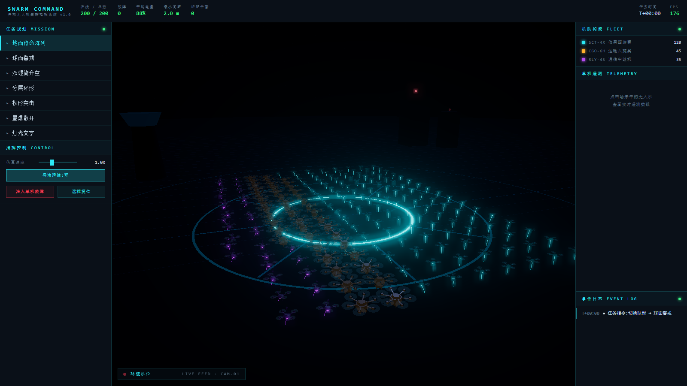

# SWARM COMMAND — 异构无人机集群灯光秀模拟

[](LICENSE)

基于 **TypeScript + Three.js + ORCA** 的异构无人机集群实时仿真软件，支持 200 架规模编队飞行、电影感夜景渲染与工业风指挥控制台，可通过 **Tauri 2** 打包为轻量化 Windows 桌面应用。



## 功能特性

- **异构机队**：侦察四旋翼 (SCT-4X)、运输六旋翼 (CGO-6H)、通信中继机 (RLY-4S)，各自不同的速度、半径与避让策略
- **ORCA 三维避障**：互惠速度障碍 + 空间哈希近邻查询，机间无碰撞
- **七种队形**：地面阵列、球面警戒、双螺旋、分层环形、楔形突击、星爆散开、灯光文字 (UAV)
- **电影感渲染**：Bloom 辉光、夜景氛围、自动导演运镜（环绕/跟拍/掠过/俯瞰）
- **工业控制台**：侧栏布局、实时遥测、任务规划、告警流、单机故障演练
- **桌面应用**：Tauri 2 + WebView2，NSIS 安装包

## 技术栈

| 层次 | 技术 |
|------|------|
| 前端 | TypeScript、Three.js r166、Vite 5 |
| 仿真 | 3D ORCA、空间哈希、固定步长积分 |
| 桌面 | Tauri 2、Rust、WebView2 |
| 文档 | XeLaTeX + ctexart |

## 快速开始

### 环境要求

- Node.js 18+
- Rust 1.70+（桌面打包）
- Windows 10/11（桌面运行，需 WebView2 运行时）

### 开发模式

```bash
npm install
npm run dev
```

浏览器访问 `http://localhost:5173`。

### 桌面开发

```bash
npm run tauri:dev
```

### 打包 Windows 安装包

```bash
npm run tauri:build
```

产物位于 `src-tauri/target/release/bundle/nsis/`。

## 项目结构

```
src/
  core/       # 仿真内核（ORCA、空间哈希、队形、集群管理）
  render/     # Three.js 场景、机型渲染、后期、运镜
  ui/         # 侧栏控制台 HUD
src-tauri/    # Tauri 2 桌面壳
docs/         # 开发日志（LaTeX + PDF）与截图
scripts/      # 截图等辅助脚本
```

## 操作说明

| 操作 | 说明 |
|------|------|
| 左栏队形按钮 | 切换编队目标 |
| 仿真速率滑块 | 0~3 倍速 |
| 导演运镜 | 自动切换机位；拖动画面退出 |
| 点击无人机 | 右栏显示单机遥测 |
| 注入单机故障 | 演练告警与坠落 |
| 远程复位 | 恢复故障机 |

## 文档

完整开发日志见 [docs/dev-log.pdf](docs/dev-log.pdf)（中文，含架构说明与界面截图）。

重新编译文档：

```bash
cd docs && xelatex dev-log.tex && xelatex dev-log.tex
```

## 作者

朱华天、Claude Fable 5、Grok 4.5、Composer 2.5

## License

[MIT](LICENSE)
